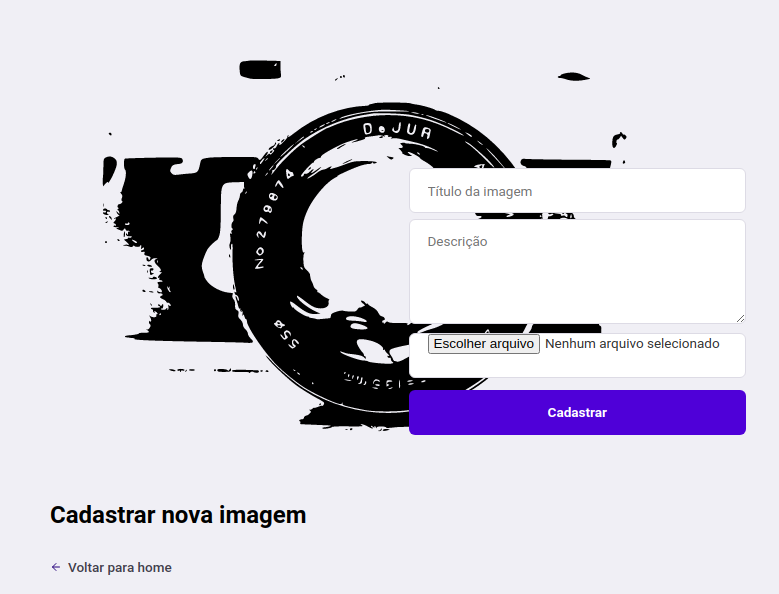

# galeria-front

front-end do projeto da galeria

**Telas**

**Objetivo**

Desenvolver uma aplicação para cadastro e galeria de imagens. Esse projeto é apenas o Front-end, que expõe uma API REST. Back-end: https://github.com/rafaellevissa/galeria 

**Autores**
Foto | Nome | GitHub | Likedin | E-mail
---- | ---- | ------ | ------- | ------
  | Rafael Levi Batista Costa | [Rafael Levi](https://github.com/rafaellevissa) | [Linkedin](https://www.linkedin.com/in/rafaellevissa/) | rafaellevissa@gmail.com

**Tecnologias**

- JS
- React Framework

**Comands***

`npm install`

`npm start`

**Contribuir**

Confira a [contributing](https://github.com/rafaellevissa/galeria-front/blob/master/CONTRIBUTING.md) página para ver os melhores locais para arquivar problemas, iniciar discussões e começar a contribuir.

**License**

Lançado em 2020.
Este projeto está sob a [License](https://github.com/rafaellevissa/galeria-front/blob/master/LICENSE).
